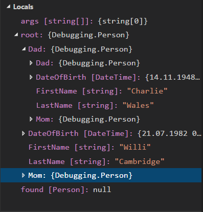

# Protokoll zur Aufgabe 2

## 1. Betrachten der Sourcecode Dateien
FamilyTree.cs: 
* die Variabel ret wird auf null gesetzt
* als nächstes wird abgefragt, ob die Person den Nachnamen Battenberg hat
* ist dies der Fall, so soll diese Person "returned" werden
* als nächstes wird wird die Mutter der Person gesucht und ebenfalls returned werden
* zuletzt wird nach dem Vater der Person gesucht, welcher auch zurückgegeben wird
Program.cs:
* in die Variable root wird der Familienstammbaum gespeichert
* in die Variable found wird die gefundene Person eingetragen
    
## 2. Klarmachen der rekursiven Datenstruktur
## 3. Auf Zeile 10 von Program.cs einen Breakpoint setzen und den Inhalt von Root im Debugger anschauen:
  
Wenn man "root" aufklappt, so kann man von der jünsten Person des Familienstammbaums den Namen und das Geburtstdatum erkennen. Außerdem wird dessen Mutter und Vater angezeigt. Beide kann man ebenfalls aufklappen.  
Klickt man auf die Mutter werdenw wieder Name, Geburtsdatum und Eltern dargestellt. etc.
## 4. Auf Zeile 23 von FamilyTree.cs einen Breakpoint setzen und den Inhalt von Root im Debugger anschauen
Bedingung in Zeile 22 so ändern, dass nicht gleich die erste Person zurückgegeben wird:
```
Person ret = null;
    if (person.LastName != "Battenberg" && person.LastName != "Cambridge")
        return person;
```
Screenshot von Debugger nach dem Ändern der Bedingung  

## 5. Komplexe Bedingung schreiben: Person finden, die in einer Alterspanne liegt:
Für die Umsetzung wird das in der Übungsaufgabe vorgeschlagene person.DateOfBirth.Year und DateTime.Now.Year verwendet.
Fertige Implementierung:  
  


    

